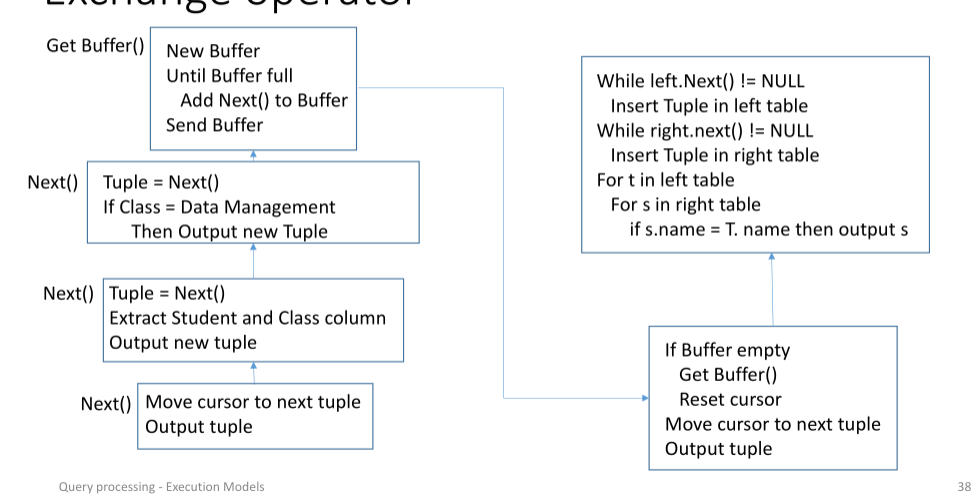
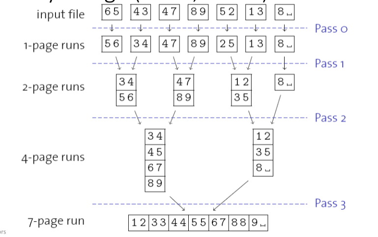
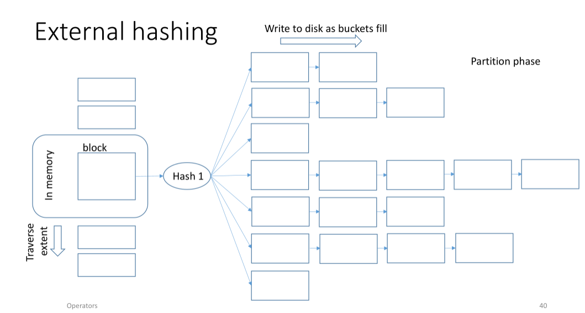
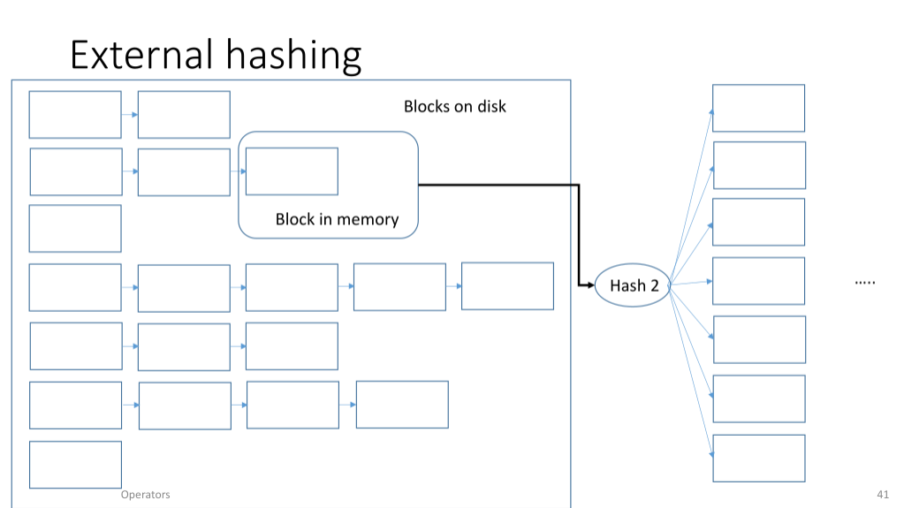
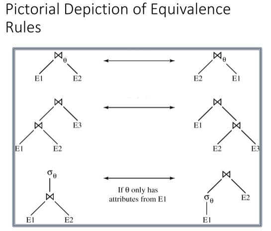

# Query Processing

## Motivation

This sits high up at the logical level. There is a whole pipeline that a query
is pushed through

- Parser _(generates IR)_
- Rewriter _(generates operator tree)_
- Optimizer _(generates query plan)_
- Code Generator _(generates code/plan)_
- Executer _(interprets or compiles)_

Query processing is super impactful for performance - any gain made in a query
is multiplied by the number of queries being processed, which could be huge.

## Execution Models

### Caching

We like to cache everywhere that we can - this involves reusing parser or
optimizer outputs by memorizing them. We can also have some intermediate 
layer/middleware that operates more like a KVS between the engine and the
client instead of implementing caching at a lower level. In large distributed
systems an intermediate caching layer could be highly beneficial.

Statement and result caches work great when queries are issues repeatedly and
don't change often, significantly reducing overhead inside the engine. But this
does indeed make some strong assumptions on the types of queries being 
processed _(homogeneous mostly)_.

Sometimes we want to cache at the client. The various DBMS interfaces are
standardized, so this caching ports across different DBs. We must distinguish
carefully between client caching and a shared caching service, especially in a
distributed system.

Be careful of caching! We may read partial results only, or read stale data.
Consistency is always an issue when we are caching in different areas.

### Processes, Threads, Pools

Some level of orchestration needs to be done by the DBMS to keep concurrent 
user queries isolated, and to be able to schedule them at all. Choosing with
which mechanism we do this is an important design decision.

- **process per worker**. We use OS threads _(already implemented by the OS, 
    which is really nice)_ and each session will be managed by an OS server
    process. Doesn't really scale well when we have lots of concurrent clients,
    and we put a lot of trust in the OS which will handle all scheduling. This
    also causes context switching between processes, which isn't cheap. 
    Moreover, there is strong isolation between OS threads, which makes shared
    data structures trickier to deal with.
- **thread per worker**. We have shared state here, which simpifies shared
    data structures. We do however trade off the stronger isolation. Modern 
    DBMS usually use threads instead of OS processes.
- **Process or thread pools:** A single client can be managed by several server
    processes _(which could be a thread or a process)_. We have a centralized
    entity that handles connections and scheduling, which passes queries to the
    pool. This can be resized, and scales well in general.

The memory allocated to a server process is called **PGA (Program Global 
Area)**, and it is organized according how it may be used, including areas for
query processing _(sort, hash, bitmap merge areas)_, session info, parameters,
cursor status.

**Cursors** are a way to return results as a pointer to a table indicating the 
next tuple to be delivered.

### Execution Models

- **Iterator model** _(volcano, pipeline)_ where tuples traverse the tree from
    leaves to root, and operators iterate over those tuples to process them.
    We get a nice generic interface, has little memory overhead, and supports
    pipelining, but we have to deal with the overhead of making lots of method
    calls.
- **Materialization** is where operators produce all of their output in one go
    and make it available in some buffer, which is used to produce the next
    buffer etc... Fantastic for OTLP where queries are usually very short and
    we can efficiently pass data around through buffers, but suffers a lot when
    the queries get really big.
- **vectorized/batch** is where operators work on sets instead of tuples. So
    they read in sets of tuples and produce sets of tuples. This is sort of a
    combination of iteration and materialization, and it makes great use of
    SIMD/AVX in modern CPUs. This works great for OLAP.

We normally like things to be in **pull mode**, where the root pulls data up
from the leaves when needed, instead of **push mode** where the leaves push
data up to their parents which often requires more synchronization and is
overall quite difficult to implement.

For parallel processing, we extend these models with an `EXCHANGE` operator 
which moves data around _(for example between machines)_ and allows for a plan
to be parallelized.



## Operators

Recall, data and indexes are stored in blocks as part of extents. We want to
minimize I/O for blocks not in memory, and we want to minimize accesses to
tuples that are in memory. We like sequential access.

The fastest way to access a single row in using its `rid`, which we find via
an index or if it is in the query directly. We only need to access the block
that holds the tuple. Once we arrive at a situation where we have multiple
`rid`s involved in a query, we might not want to access each of these randomly,
as this is highly inefficient - at the very least we want to batch to only read
each block once.

When we have multiple indexes, we may have to decide which index to use.

```sql
SELECT * FROM T
WHERE T.A = 42 and T.B > 50
```

- Find all tuples with `A = 42`, then filter on `B > 50` predicate
- Find all tuples with `B > 50`, then filter on `A = 42` predicate
- Find all tuple with `A = 42`, then all with `B > 50`, then match them

Which to use? **Depends on the relative selectivities of each predicate**.

A full table scan is nearly always the slowest, but it advantageous in some
situations namely because it can leverage prefetching. We should use it when
there is no other option, normally in situations where reading the whole table
is better than a whole lot random accesses.

We can minimize the overhead of a full table scan by using shared cursors from
other queries, only read samples _(sacrifice completeness)_. If we are working
with a column store, then once data is in memory we can use SIMD which is very
fast.

As for clustered indexes, we know that the data in an extend if organized
according to the index. This is awesome - we can scan for a single block and
then access sequentially. For example in the above query, we can scan to find
the first tuple such that `A = 42` and then scan, emitting tuples satisfying
`B > 50`. We can to this equivalently with an index on `B`, we choose the index
that is the most selective.

**Zone maps** are a mechanism that we can use to avoid reading a block by
combining coarse indexes and statistics. E.g. maintain a max and min value for
some or all columns, so that in a scan we can prevent reading blocks that we
know won't contain data we are interested in. Sort of like a bloom filter!

### Sorting, Aggregating

Data is rarely ever sorted the way we want, and the query often requires it
be sorted.

```sql
SELECT * FROM T ORDER BY (T.age)
```

Some queries don't require sorting, but are much easier over sorted data. Such
as `DISTINCT` or `GROUP BY`. However, the key problem is that sorting is
expensive because it uses memory capacity and CPU cycles. We can't sort in 
place for a base table, and thus we need to allocate extra memory.

#### External sort

Two parameters `N` _(number of input pages)_ and `M` _(size of in memory 
buffer)_. The behavior is determined by I/O, CPU, I/O cost, caches, data types,
etc...

How do we do this if not everything fits in memory? What if other queries are
also contending for that same memory? This complicates things.

#### Two-Phase External Sort

Same `M` and `N` parameters.

Phase 1:

- Load allocated buffer space with tuples
- Sort tuples in buffer pool
- Write sorted run to disk
- Repeat first step until all tuples are processed

Phase 2:

- Merge runs using priority heap

If `M >= N`, we needn't merge. If `M < sqrt(N)`, then multiple merge phases
will be necessary. This second holds because there are `N/M` runs of size `M`.
One pass perges `M-1` runs, therefore `N/M > M-1 => N > M**2` implies that we 
need more than one phase.

We want to keep at least one block in memory free for writing data out. Even
better, we can keep multiple so that we don't need to wait on a block to free
up in order to merge tuples.

#### Multi-way Merge

Merge hierarchically in a _divide-and-conquer_ fashion.



#### Optimizations

- More than one buffer for writing data out _(double-buffering)_
- Prefetching when we can
- Clustered indexes already have the data sorted, use that when we can! Allows
    for sequential access and no CPU cost for sorting
- Non-clustered indexes can be used to read the data in order, although this
    may have huge I/O cost due to the random accessing. This may work for small
    ranges, but don't count on this for large ranges.

### Hashing

If we don't need the query to be sorted, then we may just want to hash as it is
a lot cheaper. Consider the following table, for which we can build a hash 
table on the attribute of interest and operate at the bucket level.

```sql
SELECT DISTINCT(T.name) FROM T
SELECT AVG(T.age) FROM T GROUP_BY(T.level)
```

#### External Hashing

If a hash table doesn't fit in memory, partition it using a hash function, and
then use the partitions to build the hash table. If the partitions don't fit,
keep on partitioning until it does, and build the hash table in several runs.

Here we use `1` buffer to read data in, and `M-1` to write data out.




### Joins

We have a whole toolbox of algorithms that we can use for joining that optimize
for different things, and have different pre-requisites. We cover them here.

We consider $R$ the size of the outer relation, and $S$ the size of the inner
relation.

#### NLJ

Just two nested scans. We get complexity $O(R \cdot S)$, which sounds bad, but
it is actually used in practice, for example if $S$ is sorted and the join is
on an index attribute.

We always want the outer relation to be that with the smaller number of 
records, as we want to maximize sequential accesses in the inner loop which is
done more frequently.

#### BNLJ

Get a block from $R$, compare with all blocks of $S$ using hashing. This allows
us to avoid bringing in every block of S many times. This means that we get
complexity $O(blocks(R) \cdot blocks(S))$., i.e. a constant factor improvement
asymptotically.

#### NLJ with indexed table / zone maps / sorted

Each tuple in the outer relation looks up the index to find the tuples to join
with. 

In the zone map case, we use the extra statistical knowledge that we have to 
determine whether we even need to look at a given block or not.

If the input is sorted, each outer tuple only need to scan the inner tuple util
matches are possible. We can potentially reduce the search space drastically.
We can further optimize using binary search to figure out exactly where to
find the tuples we merge with.

#### Sort-Merge Join

We sort both $R$ and $S$ on the join attribute, and then merge together, 
outputting tuples one-by-one to build the new table.

#### Canonical hash join

Pretty straightforward, consisting of build phase and a probe phase. Has good
complexity in $O(R + S)$, and is easy to parallelize.

#### Grace Hash Join

This handles cases where a canonical hash table wouldn't fit in memory by using
partitioning.

- Partition $R$ and $S$ using a hash function $h$ such that each partition pair
    fits in memory
- Perform a regular hash join using hash function $h'$ on these partitions.

This is such that $R_i \times S_j = \lbrace \rbrace \forall i \neq j$. We 
choose the first hash function such that it creates memory-sized partitions, 
but not too many tiny ones. We choose the second hash function to be perfect so 
that we can build a small hash table and make he comparisons there, and emit 
joined tuples.

#### Partitioned Hash Join

Cache-conscious. Idea here is to partition input into disjoint chunks that are 
the size of cache in order to avoid cache misses when building the 
per-partition hash tables. Let `p` be the size of a partition

- `p > len(TLB)` -> `TLB` misses
- `p > len(cache)` -> cache thrashing

#### Multi-Pass Radix Partitioning

This addresses a hardware problem, which is that hardware limits fan-out, i.e.
the number of TLB entries is typically between 64 and 512.

We do multi-pass partitioning, so that the number of entries in each partition
fit inside the TLB, so that we can reduce TLB miss rate.

### Today...

Our emphasis today is on exploiting caches efficiently, exploiting SIMD, and
taking advantage of modern hardware which leverages prefetching, for example.

## Optimization

A **view** is like a virtual table that we can query. A **materialized view**
results in an actual table being added to the schema with the data described
in the view. Views are used extensively for various reasons related to how the
data is actually queried by an application.

**Schemas** provide the basic organization of the data, and views allow to
tailor that logical organization to the needs of a particular application
without altering the schema.

Snowflake schemas are highly normalized. We want to reduce redundancy by 
making normalized dimension tables. This isn't representative of how we would
want to query the data, which is why we may want a view here to make it make
sense. The more complex the schema, the more extensive the use of views.

Oftentimes queries are templated, and application will interact with an RPC
like interface. This affects processing a lot - these templates may be 
expressed over a view instead of a base table, and they may not be efficient
ways of expressing the queries!

### Query Rewriting

We want to transform a query into an equivalent one, but that is more efficient

- remove operations
- give the optimizer more freedom
- make query more explicit
- Map the query to the actual base tables rather than views

Rewriting typically does not look at statistics or cost optimization. It is
just translation based on some heuristics.

```sql

-- predicate transformation

SELECT * FROM T
WHERE (T.price > 50 AND T.price < 100)
OR (T.price > 90 AND T.price < 200);

-- becomes...

SELECT * FROM T
WHERE (T.price > 50 AND T.price < 200)
```

```sql
-- predicate augmentation (a.k.a. transitive closure)

SELECT empno, lastname, firstname, deptno, deptname
FROM employee emp, department dept
WHERE
    emp.workdept = dept.deptno AND
    dept.deptno > 'E00';
    
-- becomes...

SELECT empno, lastname, firstname, deptno, deptname
FROM employee emp, department dept
WHERE
    emp.workdept = dept.deptno AND
    dept.deptno > 'E00‘ AND
    emp.workdept > ’E00’
```

Leveraging transitivity gives the optimizer more options to consider, and thus
more room to optimize.

We want to give the optimizer as much freedom as possible.

```sql

-- predicate pushdown

CREATE VIEW d11_employee
(empno, firstnme, lastname, phoneno, salary, bonus, comm) AS
SELECT empno, firstnme, lastname, phoneno, salary, bonus, comm
FROM employee
WHERE workdept = 'D11');

SELECT firstnme, phoneno
FROM d11_employee
WHERE lastname = 'BROWN';

-- becomes... which works on the base table and in a single pass!

SELECT firstnme, phoneno
FROM employee
WHERE
    lastname = 'BROWN' and
    workdept = 'D11'`
```

Some of this stuff may be pretty trivial, but it is necessary, especially when
considering that a lot of the time the user might not even have access to the
base tables!

```sql
-- unnesting of queries
SELECT empno, firstname, lastname, phoneno
FROM employee
WHERE workdept in
(SELECT deptno
    FROM department
    WHERE deptname = 'OPERATIONS');

-- becomes ...

SELECT empno, firstname, lastname, phoneno
FROM employee emp, department dept
WHERE
    emp.workdept = dept.deptno and
    dept.deptname = 'OPERATIONS'
```

If views are materialized, we want to go to _that_ instead of the base table!
Even for partial matches between the query and the view.

```sql
MATERIALIZED VIEW (mv):
    SELECT a, b, c FROM T WHERE x = 5
QUERY:
    SELECT a, c FROM T WHERE x = 5 AND b=4
QUERY REWRITE:
    SELECT a,c FROM mv WHERE b=4
```

Another example that we may have is the following user query

```sql
SELECT distinct empno, firstname, lastname
FROM employee;

--- if empno is a key, then we can save a lot of work

SELECT empno, firstnme, lastname
FROM employee
```

### Basic Optimization Heuristics

We can take it back to basics, i.e. relational model and relational algebra.
We can formally prove equivalence between queries.



The reason we want to consider equivalent queries is because the optimizer's
job is to choose a good execution plan for a query.

### Optimizer Choices

The optimizer has a lot to choose from

- Access method for each table _(leaves in query tree)_
    - Is there an index?
    - Predicate in query? Is it on a key?
    - Clustered tables? _(same extent)_
- What implementation of each operator?
    - NLJ, hash join
    - Input sorted?
    - Useful to sort result?
- Shape and form of tree
    - Pushdown selection and projection
    - In which order should we execute joins?

Commonly, we want to do **cost-based optimization**. But this is a complex
problem, that has many variables. We focus on the biggest bottlenecks, i.e.
memory and I/O. We want to keep statistics on the data, which we collect
constantly from tables, indexes, buffers.

- Numbers of rows
- Number of blocks
- Avg. row length
- Number of distinct values in column (NDV)
- Number of nulls in column
- Dtaa distribution histogram
- Index statistics
- number of leaf blocks
- Levels
- Clustering factor
- I/O + CPU performance and utilization

These help us do cost estimations for a variety of things, including 
selectivity on skewed data.

### Calculating cost

Cardinality is easy to determine for base tables, but tricker for intermediate
results!

Selectivity 1 means everything, 0 means none of it. If we can estimate
selectivity of a query, then we know how much data will be produced. 
Selectivity is key in deciding how to do joins.

If distribution of values is independent across columns, then it is pretty
easy to determine selectivity of a composite predicate. However, if they are
correlated, it is a whole shitstorm. Sometimes we just try to guess 
correlation. Histograms are useful - just make sure it is the right one.

This should be good motivation for why systems invest in maintaining high
quality statistics.

### Rule-based optimization

Don't look at statistics or contents - free-hand it with rules based on prior
experience. This tends to be pretty accurate.

For example, Oracle uses heuristics for access methods.

With the rule-based approach, the optimizer chooses whether to use an access 
path based on these factors:

• the available access paths for the statement
• the ranks of these access paths

>To choose an access path, the optimizer first examines the conditions in the 
>statement's `WHERE` clause to determine which access paths are available. The 
>optimizer then chooses the most highly ranked available access path. Note that 
>the full table scan is the lowest ranked access path on the list. This means 
>that the rule-based approach always chooses an access path that uses an index 
>if one is available, even if a full table scan might execute faster. The order 
>of the conditions in the WHERE clause does not normally affect the optimizer's 
>choice among access paths

### Cost-Based Optimization

Here we will do things such as considering every possible way that we can
access the base tables, and the cost of doing so. We will generate all valid
ways of executing the query plan, for example all possible join orderings.
We will then evaluate costs, and pick the cheapest. This is very difficult, in
fact it is NP hard given the huge search space.

#### Interesting orders

This is what we use to describe a particular ordering _(join ordering)_ that 
may be useful down the line for another operator. Usually, pretty few of such
orderings.

#### Left-deep plans

To enumerate left-deep plans, we use an `N` pass algorithm, assuming there are
`N` relations being joined.

1. find the best 1-relation plan for each relation
2. find the best way to join that previous result to another relation, giving
    us all 2-relation plans
3. On pass `N`, we find the best way to join result of the `N-1` relation 
    plans _(as OUTER)_ with one relation plans.

For each subset of relations we only retain the cheapest overall plan as well
as the cheapest interesting ordering of the tuples.
