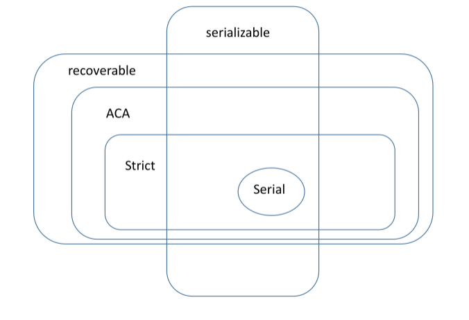
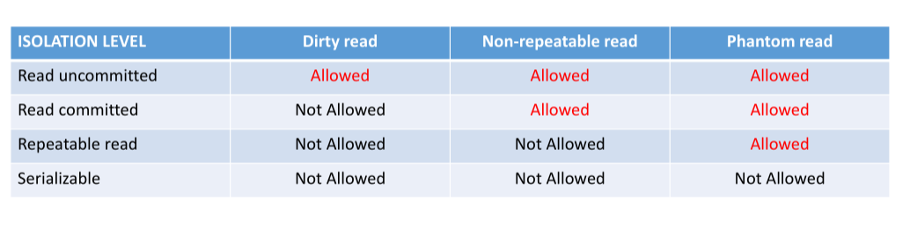

# Transaction Processing

## Concurrency Control and Recovery

Until now we have focused on optimization - now we focus on correctness, even
after a failure. We introduce **transactions**, and how they are used for
concurrency control and recovery.

We start at an abstract, theoretical level, and then later on move to 
implementation.

### The C in ACID

Formally

- **Database state:** the actual values in a DBMS at a point in time. In memory
    and in persistent storage.
- **Consistent state:** A state that is the result of a series of correctly 
    applied operations to the database.

But wait, there's more

- _correctness_: we model this with sequential execution. Everything could have
    been executed without concurrency
- _operations_: any allowed CRUD. We will see that these are grouped into
    _transactions_
- _transactions_: We assume that these are correct - given a consistent DB 
    state as input, after applying a transaction the state is consistent

DBMS enforces consistency via constraints on the tables and its values for
example. But trust is also placed in the user, i.e. the user should know what
a correct modification is semantically.

### The A in ACID

Either the transaction is executed in its entirety, or not at all. Only when a
transaction is fully executed will it bring a DB from one consistent state to
another. Intermediate results cannot be assumed correct.

We need to be able to rollback aborted transactions gracefully - **undo** them.
Atomicity _requires_ isolation, i.e. the I in ACID.

### The I in ACID

All transactions should think that they happen by themselves on the DB. No
intermediate results from other transactions, and other queries should not see
the results from an uncomitted transaction.

We need to

- Determine when a transaction is finished.
- Be able to detect conflicts.
- Resolve or prevent conflits.

Concurrency control is how we achieve isolation. The canonical way to do this 
is locking.

### The D in ACID

We want to ensure that the changes of a completed transaction are persisted, 
and can be recovered. We are often more strict - the DBMS keeps the database
state as well as a history of all transactions.

We like to use **logs** for recovery - the transaction history is captured in
the DB log, and the consistent state is captured in snapshots. These two 
combined allow the DB to go back and forth in the DB history by undoing or
redoing transactions from a given snapshot.

Concurrency control and recovery are deeply intertwined, but are often treated 
as separate problems.

### Transaction

- Beginning of transaction _(often implicit)_
- Commit, which is when it is finished and DB confirms to client when all
    changes are persisted
- Abort/rollback, which is a cancellation
- Read a data item
- Write a data item
- $a <_T b$ signifies that $a$ _happens before_ $b$ in $T$, and is a partial
    ordering _(i.e. a DAG)_.

We define conflicting operations between two transactions as two operations
over the same item, with one of htem being a write.

- `r1[x], w2[x]`
- `w1[y], w2[y]`

We define **histories**, which is a partially ordered sequence of operations
from a set of transactions where

- if $a <_T b$, then $a <_H b$
- If two operations conflict, then $p <_H q$

### Concurrency Control

H is a **serial history** if for every $T_i, T_j \in H$, either every operation
in $T_i$ appear before all operations of $T_j$ or vice-versa. A serial history
with only committed transactions is correct by definition.

Two histories are **equivalent** if they are over the same transactions 
containing the same operations, and conflicting operations of non-aborted
transactions are ordered in the same way in both histories. 

This captures the fact that in both histories, committed transactions see the 
same state, i.e. read the same values, and leave the databse in the same state 
at the end.

A history is **serializable** if it is equivalent to some serial history. A
**serializability graph** is a compact representation of the dependencies in a
history. If this graph is acyclic, then we can topologically sort it, giving
us an equivalent serial history.

#### Serializability Theorem

A history is serializable iff its serializability graph is acyclic.

### Some Alternative Transaction Models

### Commutative operations

Commutative operation  _(addition, multiplication)_ do not conflict with one
another if done in multiple transactions concurrently - if we allow for these 
to not be in conflict, then we could increase the degree of concurrency. 
However, this only works for numeric values, and operations like this aren't
standard to SQL.

### View Serializability

In this model, we say that two histories are equivalent if they are over
the same set of transactions and operations, and

- For any two transactions that abort, if one reads from the other, then they
    also read from the other in the equivalent history
- For each final write on an item in the history, it is also the final write
    in an equivalent history _(no other committed writes after this one)_.

A history is view serializable if **every prefix** is view equivalent to a
serial history.

### Access sets

If we know in advance what items a transaction will read from and write to,
then we know whether two transactions will conflict. If there is no conflict,
then we can execute lock-free. Otherwise, we must execute them serially.

We can also take a more optimistic approach, where at runtime we see what 
items are being accessed and then check at commit-time if there were any
conflicts.

### Recovery Procedures

We have a ranking of procedures.

- **R1:** undo all changes from transaction _(transaction aborts, reason 
    doesn't matter)_
- **R2:** Redo the changes from comitted transasctions _(lose main memory, keep
    disk)_
- **R3:** Undo the changes that remain in the system from active transactions 
    _(lose main memory, keep disk)_
- **R4:** Read consistent snapshot from backup, and if available, apply log
    _(system crash with loss of disks)_

We see here mention of **undo/redo**. The changes of an aborted transaction
are undone normally by restoring some _before image_ of modified value. We can
redo the changes of a comitted transasction by restoring the _after image_,
similarly. Databases log transactions by keeping before / after images of their
changes.

### Recovery On Histories

We define a notion **reads from**. `T_1` reads from `T_2` if `T_1` reads a 
value written by `T_2` at a time when `T_2` was not aborted. From this, we
can define

- **Recoverable (RC) history:** `T_i` reads from `T_j` and then commits, with
    `c_j < c_i`. This means that where is no need to unto a committed 
    transaction because it read the wrong data. Transactions are committed in
    their serialization order.
- **Avoids cascading aborts (ACA) history:** If `T_i` reads `x` from `T_j`, 
    then `c_j < r_i[x]`. This means that aborting a transaction does not cause
    any others to abort. Transactions only read from committed transactions.
- **Strict (ST) history:** If `T_i` reads from or overwrites a value written by
    `T_j`, then `c_j < r_i[x]/w_i[x]` or `a_j < r_i[x]/w_i[x]`. This means that
    undoing a transaction does not undo the changes of other transactions.
    Transactions do not read or overwrite updates of uncommitted transactions.

We like **recoverable** because in case `w_2[x] r_1[x] c_1`, `T_1` has read 
invalid data, and since it has committed, the user gets that data. Recovery
would now involve telling the application that it read something wrong - this 
is bad. We avoid by ensuring that `T_1` only commits after `T_2` has, or if
`T_2` aborts, then `T_1` can safely abort too without returning bad data to the
user.

We like **ACA** because in case `w_2[x] r_1[x] a_2`, the abortion of `T_2` will
cause `T_1` to abort as well. If this happens frequently, performance suffers.
This is avoided by making sure that uncomitted data is _never_ read. Later on
this is called _read committed_.

We like **strict** because in case `w_2[x] w_1[x] a_2`, if we have to undo
`w_2[x]`, then we also have to undo changes made by `T_1`. Undoing `w_2` also
implies undoing the changes made by `w_1` by restoring the before image. The
before image for `w_2` does not include the change made by `w_1`. Undoing
`T_2` implies aborting `T_1`, i.e. cascading aborts. We avoid this by not
letting a value be read or updated unless committed - i.e. slightly stricter 
than ACA.

Recoverability is super important because it ensure that the state of the 
database is correct.

- If I haven't got RC, then I get some data, perform some processing, then
    fine out that the read data was later removed because another program 
    aborted.
- If I haven't got ACA, then I get thrashing behavior when transasctions keep
    aborting each other, and I get a lack of forward progress.
- If I haven't got ST, then recover after a failure becomes much more complex,
    sometimes straight up impossible.

### Isolation Levels

SQL, part of ANSI, standardizes isolation levels, but differently to what we
described in the recoverability secion above. It defines 3 phenomena to be
avoided.

1. **Dirty read:** read uncommitted data, which results from non-ACA histories
2. **Non-repeatable read:** Occurs when a transaction reads the same item
    different times and sees different values each time. It's the result of
    someone else updating the item concurrently - it corresponds to a 
    non-serializable execution.
3. **Phantom Reads:** Occurs when a tuple is inserted or deleted on a table 
    while I am reading. This is a conflict at the table-level rather than
    tuple-level.

we define isolation levels

- **Read uncommitted:** not ACA, allows non-recoverable executions
- **Read committed:** ACA, but might not be serializable
- **Repeatable read:** ACA, but might not be serializable and might not be ST
- **Serializable:** does not match canonical definition of serializability that
    we introduced earlier.

None of the phenomena include write-write conflict.
`w_1[x] w_2[x] w_2[y] w_1[y]` is serializable in the SQL definition of
_serializability_, but not in our earlier definition because `T_1` happens 
before `T_2` and `T_2` happens before `T_1` in our conflict graph, which here 
is cyclic (not a DAG). This issue in particular appears when snapshot isolation 
is used to implement concurrency control. Normally the locking protocols that 
we use are stronger than the SQL isolation levels as writes are considered.

The SQL standard is too vague, basically. Since then, the topics at play are
well understood.

## Locking

### 2PL

This has been widely used for decades, and is the canonical implementation of
concurrency control. Other alternatives exist, like snapshot isolation, but 
the underlying locking mechanisms are still widely used even in those systems.
Locking has a huge impact on performance and scalability. We define shared and
exclusive locks, that are pretty self-explanatory.

The protocol of 2PL looks like

- Before accessing an object, acquire a lock.
- A transaction acquires a lock only once. Lock upgrades are possible.
- A transaction is blocked if the request cannot be granted according to the
    compatibility matrix.
- A transaction goes through two phases
    - Growth: acquire locks, but never release one
    - Shrinkage: release locks, but never acquire a new one
- At `EOT` (whether that be commit or abort) all locks must be released.

2PL prevents histories where a transaction must be aborted due to concurrency
control issues - we cannot proceed with an operation until we know it is safe.
Without, this can happen: `L1[x] w1[x] U1[x] L2[x] w2[x] L2[y] w2[y] U2[y]`,
which would mean that `T_1` could access `y` for read or write and in doing so
create a non-serializable history. This can't happen if 2PL is enforced.

In general, locks prevent two transactions from modifying the same thing at the
same time. 2PL ensures that there are no cycles in the conflict graph. What 
results is **conflict serializable histories**. What this means is that if
two operations are in conflict, their order will be the same as some serial
history. We however state nothing on the operations that aren't conflicting,
hence the notion of _conflict_ serializability.

This fits into our SQL isolation levels like so:

- **uncommitted read:** this happens when we don't acquire a lock before 
    reading, so we could read some uncommitted data
- **read committed:** we keep our read locks until the end, ensuring that we
    only read committed data. Or we get a short-lived lock for reading, which
    we release after reading, which could lead to unrepeatable reads.
- **Repeatable reads:** Write locks are kept until the end, and read locks as
    well. This means that what we read will not change throughout the 
    transaction.
- **Serializable:** We get a read lock on the whole table to prevent inserts
    or deletions.

Note that 2PL says nothing about aborting or committing transactions.

**Strict 2PL** combined 2PL with strict histories by enforcing 2PL and
enforcing that all read and write locks are held until the transaction commits
or aborts. This ensures that no uncommitted data can be read or overwritten.
All engines implement strict 2PL - it is the go-to, and we shouldn't really
do otherwise even if some papers suggest weakening guarantees.

Locking comes with the risk of **deadlocks**. In practice, we can detect them
by looking for cycles in the _wait-for_ graph. But building a graph is pretty
expensive, so we prefer to have a timer - if it expires, then we abort that
query. Deadlocks are rare enough to prefer making mistakes _(aborting 
transactions)_ than implementing a whole wait-for graph.

### Locking Table

A DBMS uses a **transaction manager** to enforce concurrency control.

- Transaction table: list of active transactions
- Transaction handler: pointer to the structures containing all the relevant
    information related to a transaction.
- Lock table: hash table containing active locks are entries _(locks on same
    object captured in a linked-list)_.
- Log: entries capturing operations performed, kept in memory until time to
    write to disk.

The basic API is 

- **Start transaction:** creates entry in transaction table, without creating
    a log entry unless explicitly stated
- **read/write operation:** hash the tuple ID to find entry in the lock table,
    and if empty, lock is granted. If there is a list, push to the end of the
    linked list, or grant request earlier if requests are compatible.
- **Write operation:** create a log entry (with LSN, before/after images,
    transaction ID, pointer to previous LSN / LSN of same transaction).
- **Commit transaction:** release locks using the transaction list, resume
    transactions that were blocked waiting, finalize log entries, write log
    entries to storage, may even write actual data modified to storage.
- **Abort transaction:** release locks using transactional lock list, resume
    waiting transactions, use log entries to undo changes _(or discard)_ and
    may write some log entries to storage.

Locking is a difficult problem, as normal read/write locks are too coarse,
and may result in too many conflicts. Table locks are too big as they lock too
much, and more granular locking helps us reduce conflicts.

We introduce **hierarchical locking**, **cursor locking**, the latter of which
is a lock used for traversing a table which uses hand-over-hand locking. A
cursor cannot overtake another cursor.

**Lock conversion** happens for example when we acquire a read lock on a whole
table, and then try to convert to a write lock when we find a tuple matching a
predicate. Lock conversion can lead to deadlocks, as we may be waiting on a 
write lock on something held by something waiting for a write lock on what we
hold a read lock for.

**Intent locks** are made to prevent other transactions from modifying the 
higher-level resource in a way that would invalidate the lock at the lower
level. We can prevent conflict detection at a high-level while still providing
low-level locks. For example acquire `IS` lock on a whole table and then do
so hierarchically downward until we find what we want to read in particular, 
and acquire a `S` lock on it. No one can write to anything while we are holding 
this. We no longer need to examine every row to detect conflicts, we can do so
much more coarsely. 

### Snapshot Isolation

This is a form of **multiversion concurrency control (MVCC)**. We apply
serializability while keeping in mind that several different versions of an
object exist. Writes will generate a new version, and reads will read from a
concrete version of the database.

A starting transaction received a timestamp `T`. All reads of that transaction
will only read what is committed as of time `T`. All writes are carried out in
a separate buffer _(shadow paging)_ and they only become visible after a 
commit. When a transaction first commits, the engine checks for conflicts. We
have a first-committer-wins rule _(any others abort)_.

It is not serializable by our first definition, as 
`r1[x]r1[y] r2[x]r2[y] w1[x] w2[y] c1 c2` is allowed, and we have 
`T2 -> T1 -> T2`. But this isn't necessarily _wrong_. By database standards, it
would be. But in an application, this isn't always a big deal - it depends on
the guarantees required by the application. This is a controversial matter.
Nearly everybody uses SI these days, definitely in modern main-memory OLTP DBs.

It fits into SQL isolation levels like so

- **Uncommitted reads:** not supported
- **Read committed:** called read consistency in Oracle. Reads from committed
    versions as of start, and write locks until the end of transaction
- **Repeatable reads:** not supported as a separate level, it is by definition
    of snapshot isolation
- **Serializable:** as discussed, and provides repeatable reads.

We can implement SI lock-free. Reads don't wait for writes and vice-versa, and
conflicting writes lead to a transaction being aborted. Reads will get the
query/transaction timestamp, and the DBMS keeps versions of the tuples by
including a LSN to the tuple entry in each block. Writing, we just create a
whole new copy of the tuple, and check at the end whether the latest version of
all written tuples is the one written. If not, then somebody committed a newer
version and we must abort.

We still use table locks to prevent too many conflicts.

## Logging

> Someone refuses to write down all of their appointments because they want to
> save paper. But when they start forgetting, they wonder if they couldn't have
> saved themselves all the hassle by just writing it down.

That's basically logging in a nutshell. Add little overhead in order to be
incredibly resilient to all types of failures.

### Recovery In a Nutshell

We want to be able to rebuild consistent DB state after a failure, whether this
be related to a transaction failure _(aborts, rollbacks, client failures)_, 
system failures _(power off, OS failure)_ or media failure _(disk failure)_.

Some of these are easy - we can undo transactions so long as they create undo
records. System failures use **redo/undo logs**, which is what we cover in this
chapter. Media failures typically require replication and the like, nothing 
that we want to separate log files from data files.

### The Log

- **before image:** value that existed in DB before transaction modifies it.
- **after image:** value that exists in DB after a transaction modified it.
- **log record:** where we store before image, after image, transaction id,
    SCN, LSN, etc...

We persist both the log and the data, and recover procedures typically involve
combining both of them (depending on design). We may also persist other data
structures, such as which transactions have committed/aborted.

Log records are ordered and reflect the logical sequence of events in the DB.
We use **LSN (log sequence number)** and **SCN (system change number)** 
depending on our needs.

### Durability

This requires that the DBMS remembers what has been committed, and that it can
recover the last committed state of the database, i.e return to a consistent
state. Durability **strictly requires** persistence - I/O is is expensive, but
we need this in order to remember what is committed. Thus when a transaction
commits, we _need_ to persist something that helps us achieve this.

So when should we write to persistent storage? 

- If changes from an active transaction end up on persistent storage, then
    recovery will require an undo
- If the changes of a committed transaction aren't yet on persistent storage,
    when the transaction is declared as committed _(client notified)_ recovery
    will involve redoing those changes.

We speak here about _undo changes_ and _redo changes_ held in some **undo log**
and **redo log** respectively.

In both cases we _need_ the log. When a transaction commits, all its log 
entries need to be persisted.

### Recovery

We first discuss the **recovery manager** which implements the recovery 
procedure. This depends on how the system functions, namely on when 
modifications are written to disk w.r.t when the transaction commits.

The recovery manager is intertwined with the operations of the buffer cache.

- **steal policy:** an uncommitted transaction is allowed to overwrite the
    persisted changes of a committed transaction. This happens when the buffer
    cache has to flush dirty pages to storage _before_ a transaction commits.
    Such occurrences require us to be able to undo this transaction if it
    aborts.
- **force policy:** all changes made by a transaction must be persisted before
    it commits. Requires us to be able to flush all updated blocks from the
    transaction. If this isn't in place, we need to be able to redo the
    transaction if the system fails before we flush.
- **Steal/no-force:** both undo and redo, the most common approach.

Locking tuples and updating the blocks they lie in may be problematic. 
Transactions that aren't in conflict may still be updating the same block.
If this is written to storage, then it is possible that some changes are 
committed while others not. If failures occur, we can't guarantee that storage
is persistent!

#### UNDO and REDO

- READ: read the value from the block in the buffer cache
- WRITE: create log entry _(before image and after image)_ and append to
    persisted log. Write the after image block to the buffer cache
- COMMIT: write a persisted log entry indicating the transaction has committed
- ABORT: for all updates, restore the before image using the log entry.

The recovery procedure is as follows

- Start from the end of the log and work backwards
- Keep a list of undone items and another for redone items
- Procedure terminates when all items are either in the undone or redone list,
    or when we reach the beginning of the log.
- For each log entry, look at the data item `x` being accessed. If `x` is in
    none of the two lists
    - If the log entry is of a committed transaction, apply the after image.
        add `x` to the redone list.
    - If the log entry if of an aborted transaction, apply the before image, 
        add `x` to the undone list

The actual data on disk is ignored as it could correspond to data from an
undone transaction. It is just used as a starting point for replaying the log.

Intuitively, we do the following for every item in the DB

- Find the last committed transaction that modified it, and REDO the 
    modification
- If no committed transaction modified it, find the first aborted transaction
    that modified it, and UNDO the modification.
- If no transaction has touched the item, its value is consistent, as we assume
    that we started at some consistent state.

In practice we can do this cheaper than replaying the whole log back-to-front.

The advantages of UNDO/REDO recovery is that we only require log records be
persisted, and we give the buffer cache lots of freedom. No need to flush
dirty pages if the space isn't needed, I/O on data minimized and only triggered
by block evictions, and allows us to write dirty data from uncommitted 
transactions to disk. It does complicate recovery and it is costly, but normal
DBMS functionality is minimally affected which is nice. Queries aren't affected
since there is no forced I/O of data! Transactions will be, though, as we
need to write updates to log.

#### UNDO, no REDO

- READ: read the value from the block in buffer cache
- WRITE: create a log entry _(before image only)_ and append it to the 
    persisted log. Write the after image to the block on the buffer cache
- COMMIT: flush all dirty values modified by the transaction if it still in the
    cache _(may already be persisted)_ and write a persistent log entry 
    indicating that the transaction has committed.
- ABORT: for all updates, restore the before image using the log entry

The recovery procedure is as follows, starting from the end of the log and
scanning backwards

- Keep list of UNDONE items
- Procedure terminates when all items are in UNDONE list or when we reach
    the beginning of the log
- For each log entry, look at the data `x` being accessed. If it is not in the
    UNDONE list and transaction as aborted, we UNDO the changes using the
    persisted before image, and add `x` to the UNDONE list.

The intuition here is that for every item in DB if no aborted transaction 
touched it, then it is correct. Otherwise, we find the _last_ aborted one and 
restore the before image. This works because of the strict execution 
assumptions we make, i.e. that there can only be one aborted transaction that
modified the correct value at the time of failure - it is enough to just undo 
that aborted transaction and we will have the last committed value.

We have some trade-offs between this model and the UNDO and REDO model from
the previous section

- We force I/O on all dirty blocks touched by a transaction. This could be
    lots of pages, and as DBMS pages grow bigger this can be costly.
- Log records no longer need the after images! Makes the log records smaller!
- Shorter recovery procedure as we only have to redo aborted transactions, and
    theoretically don't even need log entries of committed transactions.

The tradeoff here doesn't actually pay off in practice, as we still need to
write to the log with every update, and here we force **a lot** of I/O. 
Flushing the buffer cache interferes with its usual operation, i.e. slower
queries.

#### No UNDO, REDO

- READ: if the transaction did not write the item before, read the value from
    the block in the buffer cache. Otherwise, we read from a temporary buffer.
- WRITE: create the log entry _(after image)_ and append it to the persisted
    log. Write the after image to some temporary buffer _(e.g. shadow pages)_.
- COMMIT: apply all updates in the temporary buffer to the actual data blocks.
    Write to persistent log that the transaction has committed.
- ABORT: discard the temporary buffer.

Recover procedure looks like, starting from the end of the log and scanning
backwards

- Keep a list of REDONE items, terminating procedure when all items are in
    REDONE list or when we reach beginning of log
- For each log entry, look at data item accessed `x`. If it is in the REDONE
    list continue, otherwise add it, and redo the changes by using the before
    image and.

We rely on the fact that there are never dirty blocks in the buffer cache. All
data there is committed and it the last commited version. Intuitively, for
every DB item, find the last committed transaction that touched it, and REDO
it. This is needed because we aren't flushing at every commit, and it could
be that the changes made by a committed transaction aren't committed yet and
we need to redo them on recovery.

More trade-offs involved here

- Forced I/O only on log records
- Log records only need after image, making this smaller than UNDO and REDO.
- Recover procedure is shorter as it only involes REDOing the last committed
    transaction that touched an item. We theoretically don't need log entris
    for aborted transactions.

This is somewhat similar to snapshot isolation, as we read from the snapshot
at the time of start, write to a buffer which is only applied to buffer cache
on commit, and reads / writes do not interfere with each other.

#### No UNDO, No REDO

We require an auxiliary data structure for this called a directory. This
directory, at a high level, is just showing where the DBMS is pointing to at a 
given point in time.

- READ: if the value has not been written before by the transaction, use the
    current directory to find the latest committed copy. If the value has been
    written before by the transaction, use the shadow directory of that
    transaction to find the updated copy.
- WRITE: write to a buffer and add a pointer in the shadow directory for the
    transaction
- COMMIT: create a full directory by merging the current one and the shadow
    directory of the transaction
- ABORT: Discard the buffer and the shadow directory

Not really used in conventional DB. No log required

- No undo implies that we need no before images as no uncommitted data is 
    persisted.
- No redo implies that no after images are needed because when transactions
    commit, all changes are persisted.

It requires us to be able to persist all changes made by a transaction in a 
single atomic action.

The whole point of this model is that we need no recovery procedure!

This isn't really used in practice even though some of the ideas are partially
applied. Access to storage now requires an indirection through the directory
that indicates the latest version - this is pretty expensive. We also need to
garbage collect uncommitted values, as well as shadow directories etc...
Data moves a lot, which can create problems with block representation, as well
as clustered indexes.

### Implementation of Recovery

Enough with the theory. How does this actually work? Firstly, we comment on
what is inside a log entry.

- **LSN:** log sequence number used to navigate the log. We can order 
    transactions using this, and decide what goes before / after.
- **SCN:** system change number used to timestamp events. Is used in snapshot
    isolation to identify correct snapshots.
- Pointers to other log records of the same transaction
- Transaction ID and related information
- REDO related information: change vectors describing changes to a single block
    of data _(after images)_
- UNDO related information such as before images

Oracle uses a redo log as a circular buffer in memory. As transactions modify
data, redo records are created in memory and placed in the redo log buffer.
When a commit occurs, the redo records are flushed to a file in storage. We use
several files

- The log writer only writes to a single redo log file at a time
- When a file is full and needs to be archived, the LSN is increased and the
    system switches to a new redo log file

We don't want archival to interfere with normal operations, so we always have
an available log file to write to.

### Group Commit and Log Buffer Flush

Log buffer has to be flushed to disk when various events occur

- Transaction commit
- Full buffer
- Dirty pages written to storage
- Checkpoint is taken.

If we can batch this, then we want to batch it. This incurs a slight delay in
committing, but there is less I/O overhead since all log entries are written
in one go. This can happen anyway when committing from a circular log buffer.

### Write Ahead Logging 

WAL is the most common implementation of these ideas. We separate persistent
storage for data from persistent storage for the log. Log contains enough
information to implement whatever policy we have chosen, and the records
correspond to a change in the database that _must_ be written to the log before
changes to the data in the buffer cache are flushed to persistent storage.
A commit record in the log is used to mark the end of a transaction.

WAL is just a means to an end, our end being our recovery policies as we
described. It makes sense - just write to the log before anything is persisted.

We typically use this to implement UNDO/REDO _(on 2PL-based systems)_ or 
no UNDO / REDO _(on SI-based systems)_.

We note that a log would grow unbounded if we didn't use checkpoints, leading 
to storage issues and long recovery times. A checkpoint is when we push all 
dirty blocks to disk, push all the logs in the log buffer to disk, and
archive the transaction table / dirty pages table. We mark the log with a
checkpoint label and flush it to the log. Recovery happens from a checkpoint,
not from the beginning of the DB. **A checkpoint doesn't have to be a 
consistent copy of the DB**.
