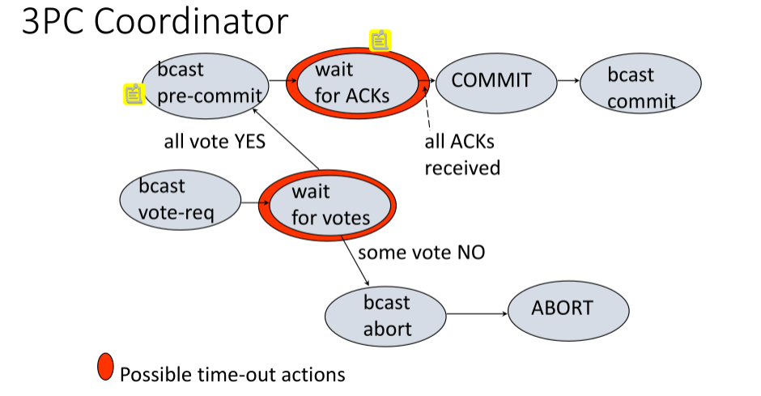

# Distributed Transactions 

## 2 Phase Commit

### Consensus Problem

The distributed consensus problem consists in reaching an agreement between all
working processes on the value of a variable. This is a hard problem in an
asynchronous distributed environment. Asynchronous means that no timing 
assumptions can be made about the speed of processes or the network delay - 
i.e. we can't distinguish between slow network and a system failure.

In the generals problem, which is just distributed consensus, I need to know:

- My own state
- The state of the other
- That the other knows my state
- That the other knows that I know their state
- That I know that the other knows that I know their state
- ...

If the system is entirely asynchronous, then we cannot solve the problem only 
by sending messages.

### Atomic Commitment

All sites must agree on whether to commit or abort a transaction, and all sites
must make the same decision. We want to enforce the following properties

- **AC1:** All processors that reach a decision reach the same one
    _(agreement, consensus)_
- **AC2:** A processor cannot reverse its decision
- **AC3:** Commit can only be decided if all processors vote YES _(no imposed
    decisions)_.
- **AC4:** If there are no failures and all processors voted YES, the decision
    will be to commit _(non triviality)_
- **AC5:** Consider an execution with normal failures. If all failures are
    repraired and no more failures occur for sufficiently long, then all
    processors will eventually reach a decision _(liveness)_.

### 2PC Protocol

In this protocol, we have a coordinator node, and participant nodes.

- Coordinator sends `VOTE-REQ` to all participants
- Upon receiving a `VOTE-REQ`, a participant sends a message with `YES` or 
    `NO`, sending `NO` if it aborts.
- The Coordinator collects all votes. If all are `YES`, then it can send a
    `COMMIT` to all, otherwise it sends `ABORT` to all that voted `YES`.
- A participant receiving `COMMIT` or `ABORT` from the coordinator decides
    accordingly and stops.

We now argue the correctness of the protocol by showing that it satisfies
conditions AC1-5.

- AC1: every processor decides what the coordinator decides
- AC2: any processor arriving at a decision stops.
- AC3: the coordinator will decide to commit if all decide to commit.
- AC4: If there are no failures and everybody voted yes, then the decision will 
    be to commit.
- AC5: the protocol needs to be extended in the case of failures. For example,
    if we timeout, a site may need to "ask around" neighbor nodes.

#### Timeout possiblilities

From the coordinator's perspective, we can only timeout in one place, which is
the phase in which we collect votes from all participant nodes. In the case of
a failure, we may block forever. However, in this case, the coordinator can 
just abort, as it knows that no participant will have committed here - thus
unblocking us by timing out.

From the participant perspective, it can block at two moments

- Wait for `VOTE-REQ`. If I haven't received one, then no one could have
    committed yet.
- Then when waiting for a decision after voting `YES`, I can block. I can't 
    abort, because I said I was going to commit. I can't commit, bceause 
    someone may have voted no. This is a problem - I can perhaps ask the 
    coordinator, but it may have failed. I can maybe ask the other participants
    about the coordinators decision. We can run what is called a _cooperative
    termination protocol_. This state is called **uncertainty period**.

Since the coordinator has no uncertainty period, and there is always at least
one processor that has decided, then if all failures are repaired, all
processors eventually reach a decision.

If the coordinator fails after receiving all `YES` votes but before sending any
`COMMIT` message, then the participants are unable to decide on anything. This
is the blocking behavior of 2PC.

For recovery and persistence, we use a log record which requires flushing the
log buffer to disk I/O. This is done for every state change in the protocol,
and it is done for every distributed transaction. This becomes pretty 
expensive.

When sending a `VOTE-REQ`, the coordinator writes a `START-2PC` log record so
that we can identify the coordinator. If a participant votes `YES/NO`, it will
write a corresponding record in the log _before_ the vote (WAL fashion). If
the coordinator decides to commit or abort, then it writes a log record before
sending the message. After receiving a coordinator's decision, a participant
writes its own decision in the log.

We can run a variant of 2PC called **linear 2PC** which minimizes the number of
network messages sent by exploiting a particular linear network configuration.
The total number of messages will be $2n$ instead of $3n$, but we also require
more rounds, which is $2n$ instead of $3$.

### 3PC protocol

With the insight that 2PC may block if the coordinator fails after sending a
`VOTE-REQ` to all processes, and all processes vote `YES`, we can reduce the
vulnerability window even further by using a more complex protocol. This isn't
really used in practice because it is too expensive, and probability of 
blocking in 2PC is low enough that we prefer to simply use that. But it is a
good means for understanding subtleties of atomic commitment.

Look at 2PC once more. If a process fails and everybody is uncertain, then 
there is no way to know whether the process has committed or aborted. But if
everyone is uncertain, then it implies that everybody voted `YES`. However,
uncertain processes cannot make a decision - just because we are uncertain 
doesn't mean that everybody else is.

3PC enforces the NB rule _(non-blocking rule)_. No operational process can 
decide to commit if there are operational processes that are uncertain. The NB
rule guarantees that if anybody is uncertain, then nobody can have decided to
commit, thus when running cooperative termination protocol, if a process finds
out that everybody else is uncertain, they can all safely decide to abort. This
now implies that the coordinator node cannot decide by itself as it did in 2PC.
In order to make a decision, we need to be sure that everybody is out of the
uncertainty period - therefore the coordinator must first tell all processes
what is going to happen _(request votes, prepare to commit, commit)_. This
implies another round of messages, hence the 3 in 3PC.

This is interesting as the processes know what will happen before it does. When
the coordinator reaches "bcast pre-commit" stage, it knows the decision will be
to commit. When a participant received pre-commit, it knows that the decision
will be to commit. While waiting for pre-commit, the participant knows that no
one has committed, and therefore there is no uncertainty period here.

The extra round of messages if used to spread knowledge across the system,
providing useful information about what is going on at other processes.

- If coordinator times out waiting for votes = ABORT.
- If participant times out waiting for vote-req = ABORT.
- If coordinator times out waiting for ACKs = ignore those who did not sent the 
    ACK! (at this
stage everybody has agreed to commit).
- If participant times out waiting for pre-commit = still in the uncertainty 
    period, ask around.
- If participant times out waiting for commit message = not uncertain any more 
    but needs to ask around!

Persistence in 3PC happens very similarly to 2PC, in that it uses a WAL.

#### Termination Protocol

- Elect a new coordinator
- New coordinator sends a `STATE-REQ` to all participants, who then send their
    state _(aborted, committed, uncertain, committable)_
- If some are aborted, abort. If some are committed, commit. If all uncertain,
    abort. If some committable but no committed received, send `PRE-COMMIT` to
    all and wait for ACKs to send a commit message.

## Replication

In this chapter, we dive into replication - a form of redundancy that is key
in a distributed setting. We will cover this at a lower-level than the Big Data
course, namely covering how updates happen when data is replicated. We are
interested in

- Performance. Local accesses are fast, over-the-network accesses are slow.
- Fault tolerance. Single site failures should not affect overall availability.
- Application type. We mainly look at OLTP and OLAP which are write and read
    intensive respectively.

We need to decide not only _when_ updates are propagates, but also _where_.
We start with the first of the two.

### When?

#### Synchronous Replication

Data is propagated immediately, and all changes are immediately applied to all
existing copies. Propagated within the scope of the transaction making the
updates.

This is refered to as _eager_ replication.

#### Asynchronous Replication

First execute the updates on the local copy, then propagate to all other 
copies. During propagation, the non-local copies will be inconsistent for a 
period of time which is application adjustable.

This is refered to as _lazy_ replication.

### Where?

#### Update Everywhere

Changes can be initiated at any of the copies - i.e. any site owning a copy.
We call this _multimaster_. This can either be implemented synchronously, or 
asynchronously.

Any transaction can run a transaction, which is leads to fairer overall
resource utilization, but we do need to synchronize copies.

#### Primary Copy

Only one copy can be updated _(the master)_. All other copies, called 
_(secondary)_ are updated reflecting the changes to the master.

This places more load on the system that holds the primary copy, and means that
reading a local copy may return out-of-date data.

### A Brief History of Replication

The earliest form of replication was primary-copy asynchronous - it was done
over tables or over materialized views _(over one table)_.

A step forward is to allow local-copy updates, then propagating to the primary
copy. Once more, this is only allowed ovre materialized views or single tables.

In practice, synchronous replication is too expensive for both primary-copy
and update-everywhere replication. Asynchronous replication is feasible in
both cases, is subject to inconsistent reads.

We notice a trade-off between correctness and performance.

### Implementing Replication

Recall, the user interacts with the DB by issuing read and write operations.
We group these into transactions that respect the ACID properties. We are
particularly interested in A and I here.

- **Isolation** is guaranteed by a concurrency control protocol, which is
    normally 2PL in commercial DBs.
- **Atomicity** is guaranteed by requiring that a transaction commit all of its
    changes. When a transaction executes at various sites, it must execute
    an _atomic commitment protocol_ - it must commit at all sites or at none
    of them. Commercial systems use 2PC for this.

On a local system, the **transaction manager** takes care of isolation and
atomicity. It will acquire locks on behalf of all transactions and then try
to come up with a serializable execution. If the transactions follow 2PL,
then serializability is guaranteed - the scheduler just needs to enforce 2PL.

Replication makes guaranteeing atomicity and isolation more complicated.
Atomicity is guaranteed by 2PC, but synchronizing serialization orders across
sites is difficult, as we need to make sure that all sites do thing in the same
order to avoid inconsistent copies. This is why we need **replication 
protocols**.

- Specifies how the different sites must be coordinates in order to provide a
    concrete set of guarantees.
- Depends on the replication strategy _(sync, async, primary-copy, 
    update-everywhere).

This has an associated cost, and doesn't scale well with the number of nodes
in the system. We want our reads to be local in order to reap performance
advantages.

#### Synchronous Update Everywhere

Assuming all sites contain the smae data, we can apply a **read one write all**
approach. Each site uses 2PL - our read operations are performed locally, and
our writes are performed at all sites using a distributed locking protocol.
This protocol guarantees that every site behaves as if there were one DB.
Site failures mean that we cannot write anywhere, so we must wait for their
recovery.

We could, when a site fails, use an approach of **writing all available 
copies**. A read means we can read any copy, and a write means that we send
`write(x)` to every copy - if a site rejects, abort. All sites not responding
are called "missing writes". To commit a protocol, check that all sites labeled
with "missing write" are still down, if not abort. Check that all sites that
were available still are, and if some don't respond, abort.

In practice, however, site failures aren't the only source of failure. We may
also have communication failures leading to network partitions. We can assume
that a communication failure means the site failed, and make that work with
existing protocols - this is a bit naive.

#### Quorum Protocols

Quorums are sets of sites formed such as to be able to determine that it will
have a non-empty intersection with other quorums.

- Simple majorities _(site quorums)_
- Weighted majorities _(quorum consensus)_
- Logical structures _(tree, matrix, projective planes quorums)_

Our desirable properties are

- **Equal effort:** all quorums should have the same size.
- **Equal responsibility:** all sites should participate on the same number
    of quorums
- **Dynamic reconfiguration:** establishing a quorum should be dynamic to
    account for failures and configuration changes
- **Low communication overhead:** minimize the number of messages exchanged.
- **Graceful degradation:** effort proportionate to failures

#### Weighted Quorums

We describe the consensus protocol for weighted quorums.

- Each copy has an assigned weight
- The total weight of all copies is $N$
- Let $RTT and $WT$ be read and write thresholds, respectively, such that
    - $2 \cdot WT > N$
    - $RT + WT > N$
- A read quorum is a set of copies such that their total weight is greater than
    or equal to $RT$
- A write quorum is a set of copies such that their total weight is greater
    than or equal to $WT$

Each copy has a version number.

- `READ`: contact sites until a read quorum is formed, then read the copy with
    the highest version number
- `WRITE`: contact sites until a write quorum is formed. Get the version number
    of the copy with the highest version number $k$, and then write to all 
    sites in the quorum adding the new version number $k + 1$

Recovery is free, but reading is no longer local and it isn't possible to 
change the system dynamically as we need to know the copies in advance.
